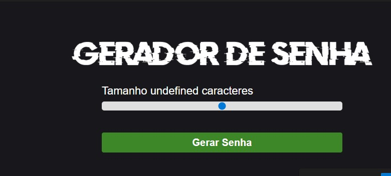
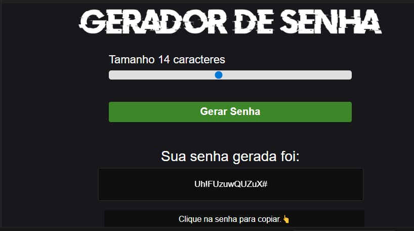

# 🔐 Gerador de Senhas

Este projeto é um **Gerador de Senhas** simples e funcional,
desenvolvido por Willians Nantes com **HTML, CSS e JavaScript**, permitindo que o usuário
escolha o tamanho da senha e copie o resultado com um clique.
[Acesse a aplicação](https://gerador-de-senha-blond.vercel.app)
------------------------------------------------------------------------

## 📸 Interface do Sistema

### Tela Inicial

### Tela com Senha Gerada

------------------------------------------------------------------------

## 📋 Estrutura

### 🖥️ **Interface (HTML)**

-   **Logo**: Exibe a imagem do programa no topo\
-   **Controle de tamanho**: Slider que permite selecionar entre **5 e
    25 caracteres**
-   **Botão de ação**:
    -   **Gerar Senha** --- chama a função `generatePassword()`
-   **Área de resultado**:
    -   Exibe a senha gerada\
    -   Inicia oculta com a classe **hide**

------------------------------------------------------------------------

## 🔧 Funcionalidades Principais

### 🎚️ Slider Interativo (`id="slider"`)

-   Ajusta o tamanho da senha\
-   **Mínimo:** 5 caracteres\
-   **Máximo:** 25 caracteres

### 🔐 Gerar Senha (`onclick="generatePassword()"`)

-   Gera uma senha aleatória conforme o tamanho escolhido\
-   Exibe a senha na tela

### 📋 Copiar Senha (`onclick="copyPassword()"`)

-   Ao clicar na senha, ela é copiada para a área de transferência\
-   Exibe a mensagem:\
    **"Clique na senha para copiar.👆"**

------------------------------------------------------------------------

## 📁 Arquivos Relacionados

-   **style.css** --- Responsável por toda a estilização visual\
-   **script.js** --- Contém toda a lógica (funções `generatePassword()`
    e `copyPassword()`)\
-   **index.html** --- Estrutura principal da interface

------------------------------------------------------------------------

## 🛠️ Como Executar

1.  Baixe ou clone o repositório\
2.  Abra o arquivo **index.html** em qualquer navegador\
3.  Use o slider para escolher o tamanho da senha\
4.  Clique em **Gerar Senha**\
5.  Clique na senha para copiar automaticamente

------------------------------------------------------------------------

## 📜 Licença

Este projeto é livre para uso e aprimoramento.

------------------------------------------------------------------------

## ✍️ Autor
Willians Nantes
💻 Projeto desenvolvido para fins educacionais — prática de lógica de programação e orientação a objetos em JavaScript.
